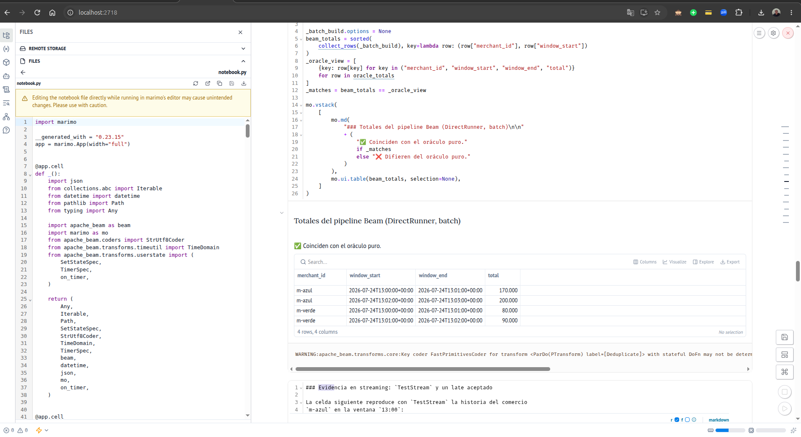
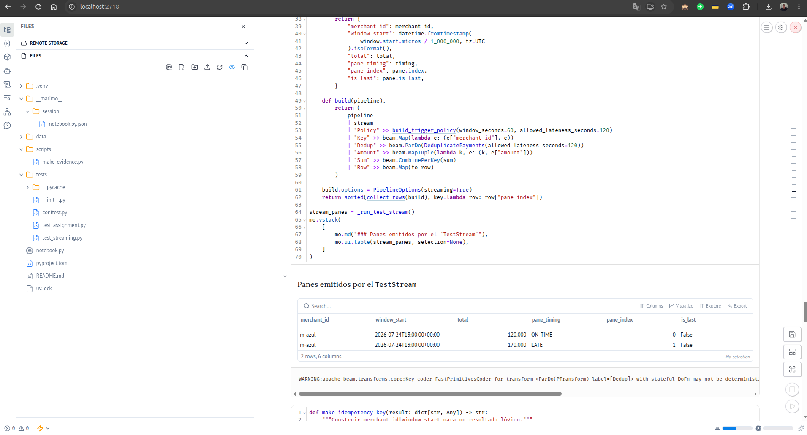

# Tarea 3 — Estado, duplicados e idempotencia con Apache Beam

Solución de la Tarea 3 de **Streaming de datos y sus aplicaciones** (FP-UNA).
Parte del [proyecto base](https://github.com/rparrapy/streaming-fpuna-clase6-tarea)
y completa `notebook.py` hasta dejar la suite de pruebas completamente verde.

## Objetivo

Producir totales confirmados por comercio y minuto:

- usando `event_time`, no el tiempo de llegada;
- tolerando hasta 120 segundos de atraso;
- descartando estados distintos de `CONFIRMED`;
- deduplicando `event_id` dentro de cada comercio, con estado y timer de expiración;
- conservando metadatos de ventana y pane;
- materializando la salida mediante una clave idempotente `merchant_id|window_start`.

## Estado de la entrega

| Ítem | Estado |
|---|---|
| Funciones de `notebook.py` (`parse_utc`, `assign_fixed_window`, `summarize_payments`, `build_windowed_totals_pipeline`, `DeduplicatePayments`, `build_trigger_policy`, `make_idempotency_key`, `simulate_sink_retries`) | implementadas |
| Suite provista `tests/test_assignment.py` (13 tests) | verde |
| Suite adicional `tests/test_streaming.py` (9 tests, incluye `TestStream`) | verde |
| `ruff check` y `marimo check --strict` | limpios |
| Evidencia de ejecución | `evidence/` |

## Ejecutar con uv

```bash
uv sync --frozen
uv run pytest                      # 22 passed
uv run marimo edit notebook.py     # editor interactivo en http://localhost:2718
uv run python scripts/make_evidence.py   # regenera evidence/
```

Atajos equivalentes: `make install`, `make test`, `make check`, `make edit`, `make evidence`.

## Ejecutar con Docker

```bash
docker compose up --build notebook     # editor Marimo en http://localhost:2718
docker compose exec notebook uv run pytest
```

o, sin levantar el editor:

```bash
make docker-test
```

El editor usa `--no-token` para simplificar el trabajo en `localhost`; no debe
exponerse a una red pública.

## Estructura

```
notebook.py              notebook Marimo con la solución y celdas de evidencia
tests/test_assignment.py pruebas provistas por la cátedra (sin modificar)
tests/test_streaming.py  pruebas agregadas: TestStream, oráculo vs Beam, casos límite
scripts/make_evidence.py ejecuta el notebook headless y vuelca resultados a evidence/
evidence/                salidas JSON del oráculo, del pipeline batch, de TestStream,
                         del sink simulado, el log de pytest y capturas del notebook
data/payments.jsonl      dataset provisto (sin modificar)
```

## Resultados sobre `data/payments.jsonl`

Configuración por defecto: ventana 60 s, lateness 120 s, deduplicación activa.

| Métrica | Valor |
|---|---:|
| Eventos de entrada | 9 |
| Aceptados | 5 |
| Descartados por estado (`PENDING`, `REJECTED`) | 2 |
| Duplicados (`p-002`) | 1 |
| Fuera de tolerancia (`p-007`) | 1 |
| Totales producidos | 4 |

| merchant_id | window_start | total |
|---|---|---:|
| m-azul | 13:00 | 170 000 (`p-001` + `p-004`, que llegó fuera de orden y tarde: *revisión*) |
| m-azul | 13:02 | 200 000 |
| m-verde | 13:00 | 80 000 (el segundo `p-002` es duplicado) |
| m-verde | 13:01 | 90 000 |

El pipeline Beam en batch produce exactamente los mismos cuatro totales
(`evidence/beam_batch_totals.json`). Con `allowed_lateness_seconds=180`,
`p-007` pasa a ser un late aceptado y `m-verde 13:00` sube a 110 000.

Evidencia en streaming (`evidence/test_stream_panes.json`): para `m-azul 13:00`
se emite un pane `ON_TIME` con 120 000 cuando el watermark cruza 13:01:00 y
luego un pane `LATE` acumulativo con 170 000 cuando llega `p-004`. Un duplicado
enviado después no genera pane alguno.

### Capturas del notebook en ejecución

Totales del pipeline Beam (DirectRunner, batch) coincidiendo con el oráculo:



Panes `ON_TIME` y `LATE` emitidos por el `TestStream`:



## Decisiones de diseño y trade-offs

### Contrato temporal y ventanas

- **`event_time` es el timestamp del dominio.** `parse_utc` acepta el sufijo
  `Z` y offsets explícitos, normaliza a UTC y rechaza con `ValueError` todo lo
  que no sea ISO-8601. Un timestamp sin zona se interpreta como UTC en lugar de
  rechazarse: es más tolerante con fuentes reales y no rompe el contrato de
  devolver siempre un `datetime` timezone-aware.
- **Ventanas alineadas al epoch**, igual que `beam.window.FixedWindows`, para
  que el oráculo puro y el pipeline coincidan bit a bit en `window_start`.
- **La tolerancia se mide como en Beam**: un evento es `too_late` si
  `arrival_time > window_end + allowed_lateness`. La alternativa
  (`arrival_time - event_time > allowed_lateness`) es más simple pero no
  coincide con el comportamiento del runner, y el oráculo tiene que servir como
  referencia del pipeline. `delay_seconds` sí se informa como
  `arrival_time - event_time` porque es la métrica legible para auditoría.
  Sobre el dataset ambos criterios clasifican igual a `p-007` (169 s de delay,
  160 s después del cierre de la ventana).
- **`revision=True`** cuando un evento aceptado llega después de `window_end`:
  es exactamente el caso que en streaming produce un pane `LATE` que corrige un
  total ya emitido.

### Orden de decisiones en el oráculo

`status` → `too_late` → `duplicate` → `accepted`. Un evento demasiado tardío
no se registra como visto: en el pipeline Beam ese dato nunca llega al `ParDo`
con estado porque el runner lo descarta antes, y el oráculo imita eso.

### Estado, deduplicación y expiración

- La clave es `merchant_id` **antes** del `ParDo` con estado, porque Beam
  particiona el estado por (clave, ventana). Por eso el mismo `event_id` en dos
  comercios distintos no colisiona (`test_deduplication_is_isolated_by_merchant`
  y `test_stateful_dofn_keeps_keys_isolated`).
- `SetStateSpec` con `StrUtf8Coder`: sólo interesa pertenencia, no orden ni
  conteo. `set(seen_ids.read())` materializa el conjunto por elemento; para
  volúmenes altos por clave y ventana convendría un `BagState` con un bloom
  filter o un estado externo, pero para el ejercicio la claridad pesa más.
- **Timer de event time en `window.end + allowed_lateness`.** Es el último
  instante en el que Beam acepta datos para esa ventana; después no puede
  llegar un duplicado que haga falta detectar, así que `seen_ids.clear()` es
  seguro. Sin el timer, cada minuto agrega un conjunto nuevo por comercio y
  ninguno se libera: el estado crece linealmente con el tiempo de ejecución
  aunque el tráfico sea constante, hasta agotar la memoria del runner.
- El timer se (re)programa en cada elemento nuevo; como el instante es el
  mismo para toda la ventana, es idempotente.

### Triggers

`AfterWatermark(early=AfterProcessingTime(10), late=AfterCount(1))` en modo
`ACCUMULATING` con `allowed_lateness=120`:

- **early** cada 10 s de processing time da una estimación mientras la ventana
  sigue abierta;
- **on-time** al cruzar el watermark el fin de la ventana;
- **late** una revisión por cada elemento tardío dentro de la tolerancia;
- **ACCUMULATING** hace que cada pane traiga el total completo. Cuesta
  reprocesar el acumulado, pero es lo que permite escribir con `UPSERT`
  sobre la misma clave y que la última escritura sea siempre correcta.
  Con `DISCARDING` el sink tendría que sumar deltas, y un reintento duplicaría
  montos.

**Nota sobre `Duration.seconds`.** El test provisto comprueba
`policy.windowing.windowfn.size.seconds == 60`, pero
`apache_beam.utils.timestamp.Duration` (Beam 2.74.0) no expone `.seconds`.
`build_trigger_policy` envuelve las duraciones en una subclase mínima
`SecondsDuration` que sólo agrega esa propiedad de lectura; `Duration.of`
respeta subclases y la serialización a proto usa `micros`, así que el
comportamiento del pipeline es idéntico.

### Batch vs streaming

En batch el watermark está en +∞ desde el inicio, así que Beam nunca
considera tardío a un elemento: `build_windowed_totals_pipeline` sin parámetros
acepta `p-007` y `m-verde 13:00` da 110 000. Para comparar con el oráculo
por defecto, el pipeline acepta `allowed_lateness_seconds` opcional que emula
la política de streaming filtrando por `arrival_time` antes de tocar el estado.
Ambas variantes están cubiertas por tests. La semántica real de lateness se
evidencia con `TestStream` en `tests/test_streaming.py` y en la celda
correspondiente del notebook.

### Idempotencia y reintentos

- Clave lógica `merchant_id|window_start`: `window_start` es la identidad de la
  ventana y no cambia entre panes, así que EARLY, ON_TIME y LATE convergen a la
  misma fila.
- `simulate_sink_retries` modela dos contratos: `POST` append-only (una lista;
  cada reintento agrega una fila y duplica el total materializado) y `UPSERT`
  (un diccionario; cada reintento reemplaza la misma clave). Para cuatro
  resultados y dos intentos: ocho filas de auditoría en ambos modos, ocho
  materializadas en append-only y cuatro en UPSERT
  (`evidence/sink_*.json`).
- Trade-off: el UPSERT exige que el destino soporte escritura por clave
  (o un `MERGE`). Si el destino sólo permite append, la deduplicación se
  traslada al consumidor (`SELECT ... QUALIFY ROW_NUMBER() OVER (PARTITION BY key
  ORDER BY attempt DESC) = 1`) y el almacenamiento crece con cada reintento.

### Casos límite cubiertos por los tests agregados

- late dentro de la tolerancia → pane `LATE` acumulativo (`TestStream`);
- duplicado tardío → ningún pane nuevo (`TestStream`);
- evento después de `window_end + lateness` → descartado por el runner
  (`TestStream`);
- pipeline batch = oráculo, con y sin política de lateness;
- `parse_utc` rechaza vacío, `None`, texto arbitrario y fechas imposibles;
- `deduplicate=False` suma los duplicados;
- múltiples resultados con reintentos en ambos modos de sink.

## Notas de implementación

Los tests compilan únicamente las definiciones de la tarea con un namespace
reducido (`beam`, `datetime`, `Any`, ...), no el módulo Marimo completo. Por
eso las funciones importan localmente lo que necesitan fuera de ese namespace
(`UTC`, `timedelta`, `trigger`, `Duration`). `data/payments.jsonl` y
`tests/test_assignment.py` no fueron modificados.
